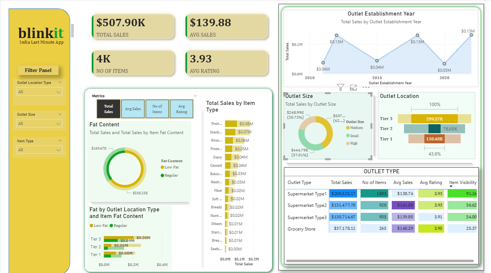

# blinkit-sales-powerbi-dashboard 

 => Project Overview

This project presents an interactive Power BI dashboard designed to analyze sales performance of Blinkit grocery outlets.
The dashboard provides insights into total sales, item categories, outlet types, customer ratings, and outlet performance.

The goal of this project is to demonstrate data visualization, business intelligence, and analytical skills using Power BI by transforming raw sales data into meaningful insights.

=> Dashboard Preview

Key Performance Indicators (KPIs)
The dashboard highlights the following important business metrics:
Total Sales: $507.90K
Average Sales: $139.88
Number of Items: 4K
Average Rating: 3.93
These KPIs help stakeholders quickly understand overall business performance.

=> Dashboard Insights

1. Sales by Outlet Establishment Year
Shows how total sales vary depending on the year an outlet was established, helping analyze growth trends.
2. Sales by Item Type
Displays which product categories generate the highest revenue, such as fruits, snacks, dairy products, and frozen foods.
3. Fat Content Analysis
Compares Low Fat vs Regular products and their contribution to total sales.
4. Outlet Size Distribution
Shows the percentage of sales coming from Small, Medium, and High outlet sizes.
5. Outlet Location Analysis
Analyzes sales based on Tier 1, Tier 2, and Tier 3 city locations.
6. Outlet Type Performance
   
Compares different outlet types like:
Supermarket Type 1
Supermarket Type 2
Supermarket Type 3
Grocery Stores
Metrics compared include:
Total Sales
Number of Items
Average Sales
Average Rating
Item Visibility

=> Features of the Dashboard
Interactive filters and slicers
Dynamic visualizations
Business KPI cards
Comparative analysis across outlet types
User-friendly layout for business decision making

=> Tools & Technologies Used
Power BI
Data Visualization
DAX (Data Analysis Expressions)
Data Cleaning & Transformation
Microsoft Excel / CSV Dataset

=> Learning Outcomes

Through this project I learned:
Building interactive dashboards in Power BI
Creating KPIs and business metrics
Data visualization best practices
Using slicers and filters for dynamic analysis
Converting raw data into actionable insights

=> Business Impact 
Example:
The insights from this dashboard can help Blinkit:
Identify high-performing outlet types
Optimize inventory for high-selling product categories
Focus expansion in high-revenue city tiers
Improve product strategy based on customer preferences

=> Screenshorts / Demo 

Shows what the dashboard look like :- (blinkit_sales_dashboard.png) 

Example :
[Dashboard Preview](https://github.com/anuradha081/blinkit-sales-powerbi-dashboard/blob/main/blinkit_sales_dashboard.png)

